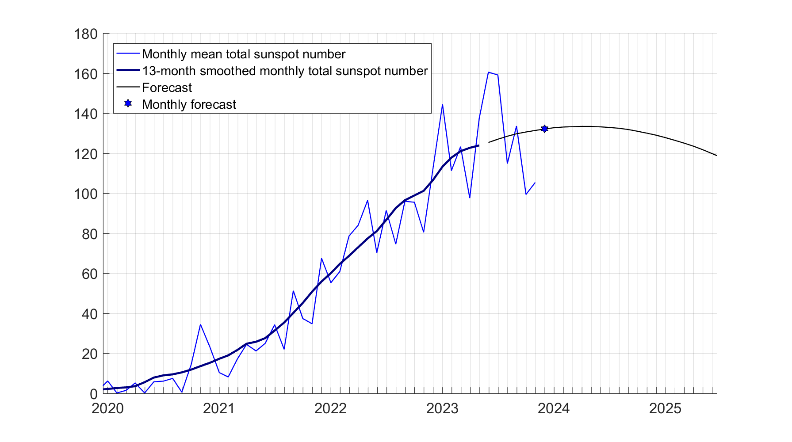
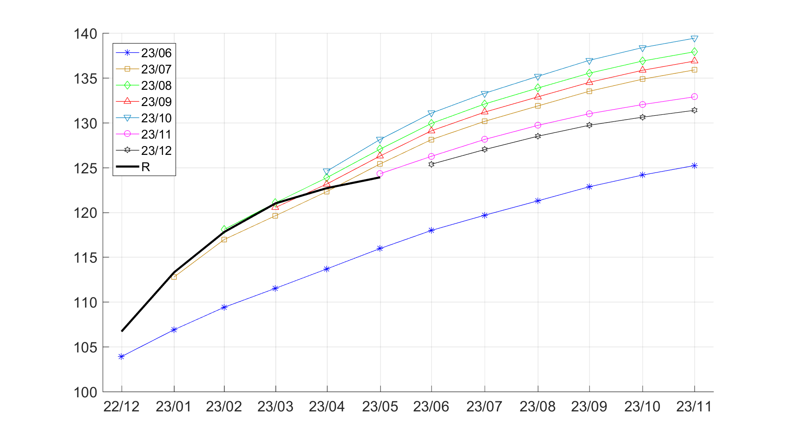
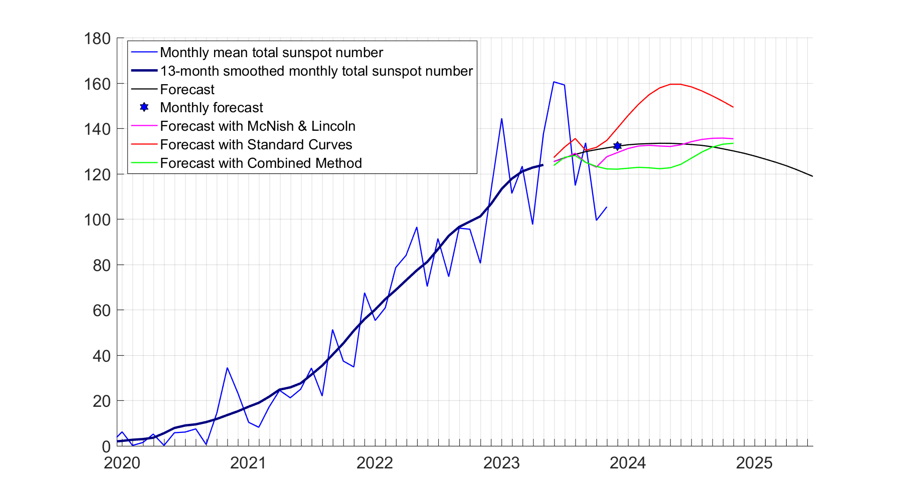
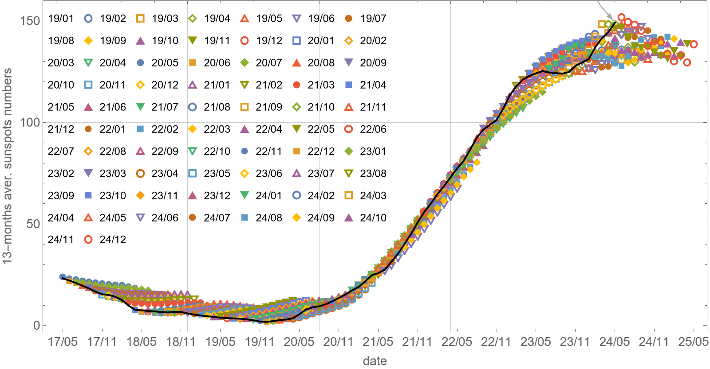
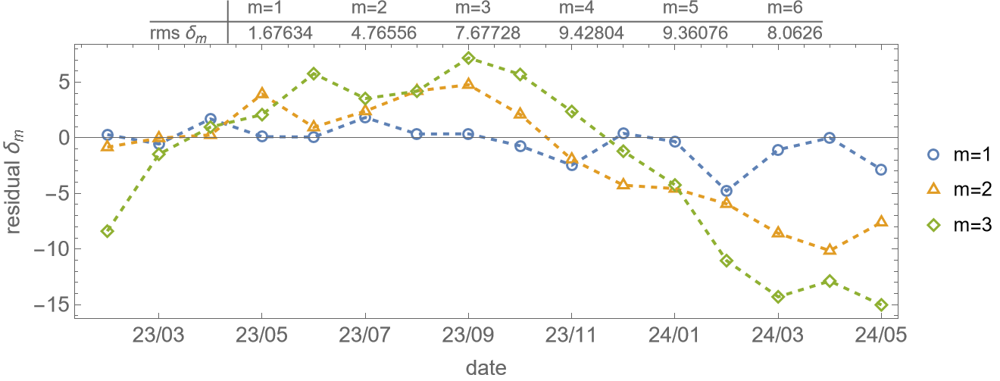
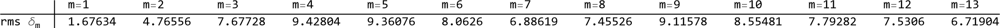

# SolarActivityPrediction

### Description

This repository contains data of solar activity forecast. 
Data are obtained using a method based on a combination of the numerical solution of the nonlinear mean-field dynamo equations and the artificial neural network.
The detail can be found in the paper (https://doi.org/10.1017/S0022377818000600, PDF-file  in the `doc/` folder).

### Data format
We update our forecast of 13-months running averaged sunspot numbers at the beginning of each month.
The files `predict_YY_MM.csv`appear in the `data/` folder.

Format: Comma Separated values

Contents:
- Column 1-2: Gregorian calendar  Year-Month
- Column 3: predicted sunspot numbers 

### Specific time intervals

| Date period    |      Reference  |
|----------------|----------|
|1997/01—2017/10 | tuning methodology |
|2017/11—2021/09 | monthly forecast for testing |
|2021/10—        | monthly forecast during the project |

## Prediction Accuracy Analysis (plots)
We compare our forecast with observational data provided by https://www.sidc.be/silso/datafiles
(`SN_ms_tot_V2.0.csv` is available in the `doc/` folder).

* Actual forecast

* Latest monthly evaluated predictions and observations  `R`

* Comparison with the other methods of forecast

* Forecast data in table form. Each column is for the date of predicted 13-months running average sunspot number (-6 months from the date of the given forecast). Each raw is for the date when the solar activity was predicted  

* All forecasts curves

* Residual between the predicted and the observed sunspots number for different forecast depths (`m` - months ahead)

* Standart deviation of the residual between the predicted and the observed sunspots number for different forecast depths (`m` - months ahead)

> The project is supported by the Russian Science Foundation (grant No.21-72-20067).
